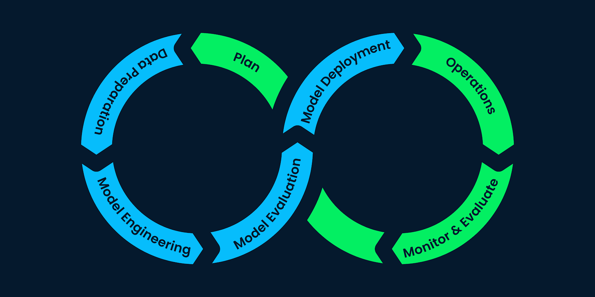

# 
<a href="https://sistema-recomendacion-steam-28s3.onrender.com/docs">Sistema de recomendación de videojuegos de Steam</a>

## Descripción del proyecto

En este proyecto desarrollé una API para consultas con un sistema de recomendación utilizando datos de **Steam**, una plataforma internacional de videojuegos. La misma proporciona varios endpoints que permiten consultar información sobre desarrolladores, usuarios, géneros de juegos y, lo más importante, un sistema de recomendación de videojuegos.

### Desafíos iniciales y rol a desarrollar

Al explorar los datos proporcionados, descubrí que estaban en un estado bruto y desorganizado, con datos anidados y sin un sistema de actualización automatizado. Esto planteaba una serie de problemas que debían ser abordados desde el principio para poder desarrollar un sistema de recomendación funcional.
Asumí el rol de **Data Scientist** con la misión de desarrollar el sistema de recomendación, pero también me vi obligado a desempeñar funciones de **Data Engineer**, creando un ***MVP (Minimum Viable Product)*** desde cero. Ha sido un gran desafío que requirió mucho esfuerzo y trabajo para llegar a los objetivos planteados.

### Tecnologías Utilizadas
- Python
- Pandas
- Numpy 
- Scikit-learn
- Uvicorn
- FastAPI
- Gzip
- Ast
- TextBlob
- Seaborn
- Matplotlib
- Wordcloud

### Soluciones Implementadas

#### 1) [Transformación de Datos](https://github.com/SantosIparraguirre/Sistema-Recomendacion-Steam/tree/main/ETL)

Para optimizar el rendimiento de la API y del modelo de machine learning, trabajé en la lectura del dataset en el formato correcto, eliminando columnas innecesarias y realizando las transformaciones necesarias. 
*Nota: las transformaciones principales de los datos originales se encuentran en los notebooks de [etl_steam_games](https://github.com/SantosIparraguirre/Sistema-Recomendacion-Steam/blob/main/ETL/etl_steam_games.ipynb), [etl_user_items](https://github.com/SantosIparraguirre/Sistema-Recomendacion-Steam/blob/main/ETL/etl_user_items.ipynb) y [etl_user_reviews](https://github.com/SantosIparraguirre/Sistema-Recomendacion-Steam/blob/main/ETL/etl_user_reviews.ipynb). Los notebooks restantes corresponden al preprocesamiento de estos datasets para cada endpoint en particular.*

#### 1.1) [Ingeniería de Características (*Feature Engineering*)](https://github.com/SantosIparraguirre/Sistema-Recomendacion-Steam/blob/main/ETL/etl_user_reviews.ipynb)
Utilicé **análisis de sentimiento (NLP)** en las reseñas de usuarios para crear una nueva columna llamada *'sentiment_analysis'*. Esta columna asigna un valor de '0' para reseñas negativas, '1' para neutrales y '2' para positivas. Este análisis de sentimiento ayuda a mejorar el rendimiento de los modelos de machine learning y facilita el análisis de datos.

#### 2) [Análisis Exploratorio de Datos (EDA)](https://github.com/SantosIparraguirre/Sistema-Recomendacion-Steam/tree/main/EDA)
Llevé a cabo un análisis exploratorio de los datos para identificar relaciones entre variables, detectar outliers y anomalías, y descubrir patrones interesantes. Este análisis fue crucial para entender los datos y prepararlos adecuadamente para el modelado. Puedes revisar las métricas, gráficos y nubes de palabras en el notebook.

#### 3) [Despliegue y uso de la API](https://github.com/SantosIparraguirre/Sistema-Recomendacion-Steam/blob/main/main.py)
La API está desplegada en [Render](https://render.com/) y se puede acceder a través de varios **endpoints**:

***/developer:*** Consulta información sobre un desarrollador específico y obtiene la cantidad de juegos y porcentaje de contenido free agrupados por año.

***/userdata:*** Obtiene detalles sobre un usuario, incluido el dinero gastado, el porcentaje de recomendación y la cantidad de juegos.

***/userForGenre:*** Encuentra al usuario que ha acumulado más horas jugadas para un género dado y detalla la acumulación de horas jugadas en cada año.

***/best_developer_year:*** Devuelve un top 3 de desarrolladores según los juegos más recomendados para el año ingresado.

***/developer_reviews_analysis:*** Proporciona un resumen de las reseñas de usuarios para un desarrollador dado.

**/recomendacion_juego:** Recibe un ID de juego y recomienda 5 juegos similares, basándose en la similitud del contenido. Puedes descargar el siguiente [archivo excel](https://github.com/SantosIparraguirre/Sistema-Recomendacion-Steam/blob/main/Datasets/listado_juegos.xlsx) para ver el listado de juegos y sus respectivos ID. 
*Nota: Puedes buscar un título específico con ctrl+f*

**/recomendacion_usuario:** Recibe un ID de usuario y recomienda 5 juegos, basándose en las características y reseñas de los juegos del usuario.

**Ingresá a la API a través de este [link](https://sistema-recomendacion-steam-28s3.onrender.com/docs) para poder ejecutar las consultas.**

### Conclusión
Este proyecto ha sido una excelente oportunidad para aplicar y consolidar mis conocimientos en MLOps, desde la recolección y transformación de datos hasta el desarrollo, despliegue y validación de los modelos de similitud de coseno. Me pone muy contento haber logrado desarrollar un sistema de recomendación de videojuegos robusto para la plataforma Steam, asegurando una implementación eficiente en un entorno real.

### Información extra

#### [Diccionario de datos Steam](https://github.com/SantosIparraguirre/Sistema-Recomendacion-Steam/blob/main/Datasets/Diccionario%20de%20Datos%20STEAM.xlsx)

#### Modelo de Similitud de Coseno: 
El modelo de **similitud de coseno** es una técnica comúnmente utilizada en la recuperación de información y el filtrado colaborativo, que permite calcular la similitud entre vectores de características. En el contexto de este sistema de recomendación de videojuegos para Steam, el modelo se utiliza para encontrar juegos similares en función de las características de los mismos.

En la implementación de este proyecto, se calculó la similitud de coseno entre vectores de características que representan diferentes juegos. Estos vectores de características pueden incluir información como género, desarrollador, reseñas de usuarios, entre otros. Una vez calculada la similitud de coseno, se identificaron los juegos más similares y se recomendaron al usuario.

Para calcular la similitud de coseno, se utilizó la biblioteca ***scikit-learn*** en Python, que proporciona herramientas eficientes para el análisis de datos y la minería de textos.

#### Glosario:

- **Data Scientist:** Un profesional que utiliza técnicas estadísticas, de programación y de aprendizaje automático para analizar y obtener información a partir de datos.

- **Data Engineer:** Un especialista en el diseño y mantenimiento de sistemas de gestión de datos, incluidas bases de datos, pipelines de datos y plataformas de almacenamiento de datos.

- **MVP (*Minimum Viable Product*):** El producto mínimo viable es una versión simplificada de un producto que se utiliza para probar la viabilidad de una idea y recopilar feedback de los usuarios antes de invertir en su desarrollo completo.

- **ETL (*Extract, Transform, Load*):** Proceso utilizado para extraer datos de varias fuentes, transformarlos en un formato adecuado y cargarlos en un sistema de destino, como una base de datos.

- **API (*Application Programming Interface*):** Un conjunto de reglas y definiciones que permite a diferentes software comunicarse entre sí. En este contexto, se refiere a la interfaz de programación de la aplicación utilizada para acceder y manipular los datos de Steam.

- **NLP (*Natural Language Processing*):** Un campo de la inteligencia artificial que se ocupa de la interacción entre las computadoras y el lenguaje humano.

- **EDA (*Exploratory Data Analysis*):** Proceso de análisis de datos para resumir las características principales de un conjunto de datos, a menudo con métodos visuales.

- **Despliegue de la API:** La acción de hacer que una API esté disponible y accesible para su uso, generalmente a través de un servidor web o una plataforma en la nube.

#### Links útiles:

- [Sitio web oficial de Steam](https://store.steampowered.com/)
- [Documentación de FastAPI](https://fastapi.tiangolo.com/)
- [Documentación de Pandas](https://pandas.pydata.org/pandas-docs/stable/reference/index.html)
- [Documentación de Scikit-Learn](https://scikit-learn.org/stable/api/index.html)

#### Contacto:

- [Linkedin](www.linkedin.com/in/santos-iparraguirre-b738a82b3)
- [GitHub](https://github.com/SantosIparraguirre)
- E-mail: santosiparraguirrem@gmail.com